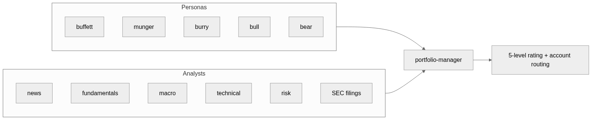
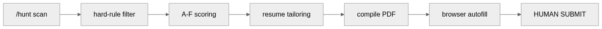
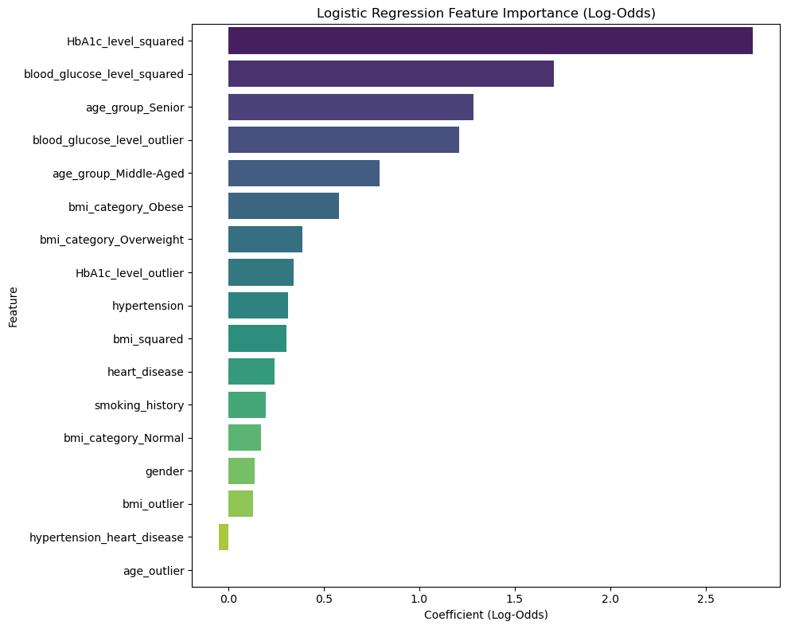
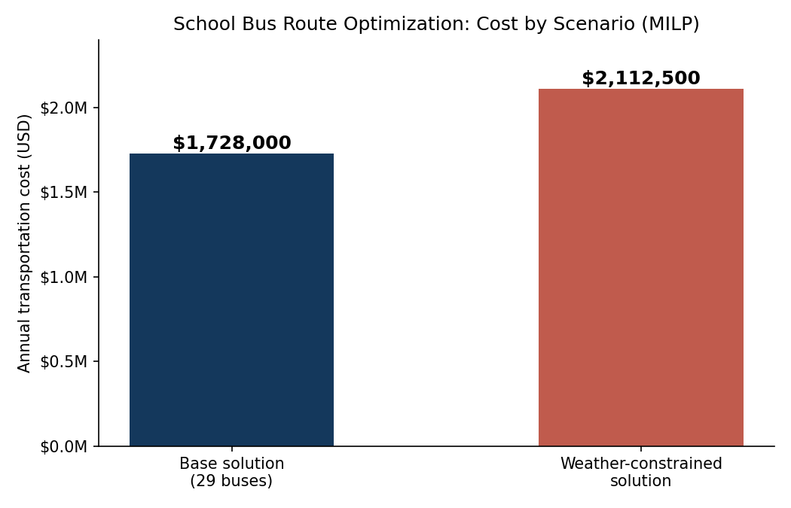

# Hi, I'm Allen 👋

**People Analyst @ Electronic Arts | UBC MBAN | Data & AI Engineering**

I build AI agent workflows and data products: a multi-agent investing framework where Buffett, Munger, and Burry personas debate my portfolio, an end-to-end job application pipeline, and the forecasting, optimization, and machine learning work below. Claude Code and MCP are built into how I work every day.

## 🔭 Now

- Building [claude-multi-agent-investing](https://github.com/haiiibin/claude-multi-agent-investing): teaching 12 agents to argue about my portfolio so I don't have to
- Stress-testing [ai-job-hunt-pipeline](https://github.com/haiiibin/ai-job-hunt-pipeline) against real Chinese recruiting portals and folding the fixes back into the repo
- People analytics at Electronic Arts

## 📌 Featured Projects

### [Claude Multi-Agent Investing](https://github.com/haiiibin/claude-multi-agent-investing)

12 agents (Buffett, Munger, and Burry personas, 6 fact-gathering analysts, 1 portfolio-manager synthesizer) debate every holding through 13 slash commands: tax-aware for Canadian accounts, advisory only, zero API cost beyond a Claude Code subscription.

### [AI Job Hunt Pipeline](https://github.com/haiiibin/ai-job-hunt-pipeline)

End-to-end Claude Code workflow: scan job boards, hard-rule filter, A-F scoring against a weighted rubric, one-page resume tailoring, PDF compile, browser autofill, and a hard stop so a human always hits Submit. A leaner [North America version](https://github.com/haiiibin/ai-job-hunt-pipeline-na) ships separately.

### [YVR Energy Consumption Forecasting](https://github.com/haiiibin/Vancouver-International-Airport-Energy-Consumption-Forecasting)

Forecasting 14 years of monthly energy consumption for Vancouver International Airport with Box-Cox transformation and seasonal ARIMA: **1.7% MAPE** on holdout data, with 3-year projections supporting procurement planning.

### [Machine Learning for Diabetes Risk Screening](https://github.com/haiiibin/Machine-Learning-for-Diabetes-Risk-Screening)

Two-stage ML pipeline (logistic regression screening, then random forest diagnosis) that cuts unnecessary lab tests by **30%** while keeping **95% detection sensitivity** (F1 = 0.87).

### [School Bus Route Optimization](https://github.com/haiiibin/school-bus-route-optimization)

Mixed-integer linear programming model reassigning 2,000 students after a school closure: base solution **$1.73M/year with 29 buses**, plus a weather-constrained scenario quantifying the safety vs. cost trade-off.

**More projects:** [AI job hunt pipeline (North America)](https://github.com/haiiibin/ai-job-hunt-pipeline-na) · [US stock price prediction (VAR / LASSO / LSTM)](https://github.com/haiiibin/us-stock-price-prediction) · [10-K NLP industry analysis](https://github.com/haiiibin/health-service-industry-analysis) · [TikTok reviews sentiment analysis (Python + R)](https://github.com/haiiibin/tiktok-reviews-sentiment-analysis) · [Nutrition planning optimization (LP)](https://github.com/haiiibin/nutrition-planning-optimization)

## 🛠 Tech Stack

- **Languages & Data Science:** Python, R, SQL, Pandas, NumPy, scikit-learn, PyTorch, TensorFlow, statistical inference, time series forecasting
- **Visualization & BI:** Power BI, Tableau, Looker Studio, Excel (advanced modeling)
- **Databases & Cloud:** PostgreSQL, MS SQL Server, MongoDB, Neo4j, Google BigQuery, AWS, Google Cloud, Azure
- **AI & Developer Tools:** Claude Code (MCP, CLI, API), GitHub Copilot, prompt engineering, AI workflow automation

## 📊 GitHub Stats

## ⚡ Recent Activity

<!-- Auto-updated daily by .github/workflows/update-readme.yml -->
<!--RECENT_ACTIVITY:start-->
- `2026-07-07` Pushed 1 commit to [haiiibin/haiiibin.github.io](https://github.com/haiiibin/haiiibin.github.io)
- `2026-07-06` Pushed 1 commit to [haiiibin/haiiibin.github.io](https://github.com/haiiibin/haiiibin.github.io)
- `2026-07-06` Pushed 1 commit to [haiiibin/haiiibin](https://github.com/haiiibin/haiiibin)
- `2026-07-06` Pushed 1 commit to [haiiibin/ai-job-hunt-pipeline-na](https://github.com/haiiibin/ai-job-hunt-pipeline-na)
- `2026-07-06` Pushed 1 commit to [haiiibin/ai-job-hunt-pipeline](https://github.com/haiiibin/ai-job-hunt-pipeline)
<!--RECENT_ACTIVITY:end-->

## 🎓 Education & Certifications

- **Master of Business Analytics (MBAN)**, UBC Sauder School of Business (Nov 2025)
- **BA in Economics**, Minor in Commerce, UBC (May 2024), graduated with distinction
- **CFA Level II Candidate**

## 📫 Contact

