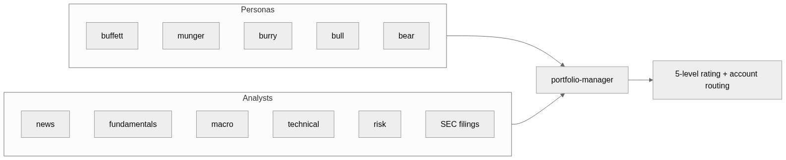

# Hi, I'm Allen 👋

**Data & AI Analyst | UBC MBAN | Forecasting · Optimization · ML**

I build AI agent workflows and data products: two MCP servers published on PyPI (a tabular-data profiler and a Canadian capital-gains engine), and a multi-agent investing framework where Buffett, Munger, and Burry personas debate my portfolio. Claude Code and MCP are built into how I work every day.

## 🔭 Now

- Shipped [data-profiler-mcp](https://github.com/haiiibin/data-profiler-mcp) and [acb-tax-mcp](https://github.com/haiiibin/acb-tax-mcp): on PyPI and the official [MCP Registry](https://registry.modelcontextprotocol.io), listed in awesome-mcp-servers, Glama score A for both, 1,000+ combined installs a month
- Building [claude-multi-agent-investing](https://github.com/haiiibin/claude-multi-agent-investing): teaching 12 agents to argue about my portfolio so I don't have to
- Contributing fixes upstream to the tools I depend on: darts, PuLP, sec-edgar-mcp, yahoo-finance-mcp (see Open Source below)
- Opened up [vlog-pipeline](https://github.com/haiiibin/vlog-pipeline): scene detection, whisper.cpp subtitles, Claude-generated cut lists and an ffmpeg renderer that turn a week of raw phone clips into a 9:16 vlog draft

## 📌 Featured Projects

### [Claude Multi-Agent Investing](https://github.com/haiiibin/claude-multi-agent-investing)

12 agents (Buffett, Munger, and Burry personas, 6 fact-gathering analysts, 1 portfolio-manager synthesizer) debate every holding through 13 slash commands: tax-aware for Canadian accounts, advisory only, zero API cost beyond a Claude Code subscription.

### [data-profiler-mcp](https://github.com/haiiibin/data-profiler-mcp) · on [PyPI](https://pypi.org/project/data-profiler-mcp/)

MCP server that lets an LLM understand any tabular data file (CSV, Parquet, Excel, JSON): schema, per-column statistics, severity-ranked data-quality flags, correlation analysis with multicollinearity warnings, and memory-saving dtype suggestions. `pip install data-profiler-mcp`, CI-tested on Python 3.10 to 3.13.

### [acb-tax-mcp](https://github.com/haiiibin/acb-tax-mcp) · on [PyPI](https://pypi.org/project/acb-tax-mcp/)

Canadian adjusted cost base and capital gains for LLM agents: CRA average-cost method, per-disposition realized gains, superficial-loss detection, Schedule 3 per-security summaries, unrealized gains against market prices, and a normalizer that turns raw broker CSV exports into clean transactions. Decimal-precise to the cent, zero heavy dependencies, a calculation aid (not tax advice).

## 🔧 Open Source Contributions

Besides maintaining [data-profiler-mcp](https://github.com/haiiibin/data-profiler-mcp) and [acb-tax-mcp](https://github.com/haiiibin/acb-tax-mcp) (both on PyPI), I contribute fixes upstream to the tools I depend on:

- [unit8co/darts #3167](https://github.com/unit8co/darts/pull/3167) optional `min_train_length` on local forecasting models, so short time series can train models that previously hard-required 10 points (**merged**)
- [coin-or/pulp #936](https://github.com/coin-or/pulp/pull/936) expose CBC's `randomSeed` on `COIN_CMD` for reproducible MILP solves (**merged**)
- [sec-edgar-mcp #142](https://github.com/stefanoamorelli/sec-edgar-mcp/pull/142) fix 9 tools whose descriptions were silently empty (f-string docstrings never reach `__doc__`), with a regression test (under review)
- [yahoo-finance-mcp #16](https://github.com/Alex2Yang97/yahoo-finance-mcp/pull/16) start/end date-range support for historical prices (closes an open issue)
- [yahoo-finance-mcp #17](https://github.com/Alex2Yang97/yahoo-finance-mcp/pull/17) US class-share ticker normalization, so `BRK.B` stops silently returning empty data

## 🛠 Tech Stack

- **Languages & Data:** Python, R, SQL (PostgreSQL, BigQuery), Pandas, scikit-learn, PyTorch
- **Modeling:** time series forecasting, optimization (MILP / LP), statistical inference, ML pipelines
- **BI & Visualization:** Power BI, Tableau, Looker Studio, advanced Excel
- **AI & Developer Tools:** Claude Code (MCP, CLI, API), GitHub Copilot, prompt engineering, AI workflow automation

## 📊 GitHub Stats

## ⚡ Recent Activity

<!-- Auto-updated daily by .github/workflows/update-readme.yml -->
<!--RECENT_ACTIVITY:start-->
- `2026-08-14` Published release in [haiiibin/claude-multi-agent-investing](https://github.com/haiiibin/claude-multi-agent-investing)
- `2026-08-14` Published release in [haiiibin/acb-tax-mcp](https://github.com/haiiibin/acb-tax-mcp)
- `2026-08-14` Published release in [haiiibin/data-profiler-mcp](https://github.com/haiiibin/data-profiler-mcp)
- `2026-07-30` Published release in [haiiibin/claude-multi-agent-investing](https://github.com/haiiibin/claude-multi-agent-investing)
- `2026-07-29` Published release in [haiiibin/data-profiler-mcp](https://github.com/haiiibin/data-profiler-mcp)
<!--RECENT_ACTIVITY:end-->

## 🎓 Education & Certifications

- **Master of Business Analytics (MBAN)**, UBC Sauder School of Business (Nov 2025)
- **BA in Economics**, Minor in Commerce, UBC (May 2024), graduated with distinction
- **CFA Level II Candidate**

## 📫 Contact

Happy to talk AI-agent tooling or analytics work. Reach me here:

